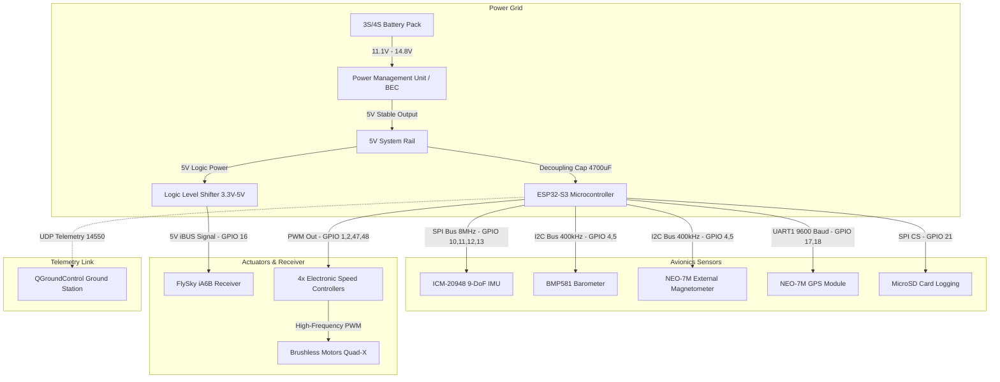

# 🛠️ AeroCore-S3 Flight Controller: Advanced Systems Engineering Log
**Detailed Hardware-Software Integration, Avionics Architecture, & Systems Debugging Retrospective**

---

## 1. Project Overview & Scope
The **AeroCore-S3** project is a custom avionics platform designed to run ArduPilot's professional autonomy stack on the low-cost, high-performance **ESP32-S3 (WROOM-1)** microcontroller. Building a custom flight controller requires bridging bare-metal IoT hardware limitations with real-time, high-integrity aeronautical control loops. This log chronicles the systems architecture, schematic pinout mapping, custom HAL definition compilation, and complex hardware/software failures resolved to achieve stable autonomous flight.

---

## 2. Avionics & Systems Architecture

The system coordinates telemetry, remote control input, and flight dynamics sensors through low-latency SPI, I2C, and UART serial communication buses.

### 📊 System Block Diagram


---

## 3. Hardware Abstraction Layer (HAL) Mapping
Below is the precise pin-to-peripheral mapping established in the custom ArduPilot board definition compiler directives (`hwdef.dat`):

| Component / Bus | Function | ESP32-S3 Pin | Hardware Attribute / Configuration |
| :--- | :--- | :--- | :--- |
| **Power Input** | 5V / VIN | V5 / VIN | Integrated 4700uF 25V capacitor across raw rails. |
| **IMU** | SPI CS | GPIO 10 | Dedicated SPI select for ICM-20948. |
| **IMU** | SPI MOSI | GPIO 11 | Shared hardware SPI bus (SPI2_HOST). |
| **IMU** | SPI MISO | GPIO 13 | Shared hardware SPI bus. |
| **IMU** | SPI SCK | GPIO 12 | Shared SPI clock (8MHz). |
| **Sensors** | I2C SDA | GPIO 4 | Shared low-voltage I2C bus (I2C_NUM_0, 400kHz). |
| **Sensors** | I2C SCL | GPIO 5 | Shared low-voltage I2C bus (I2C_NUM_0, 400kHz). |
| **GPS** | UART TX | GPIO 18 | Connects to Ublox NEO-7M RX. |
| **GPS** | UART RX | GPIO 17 | Connects to Ublox NEO-7M TX (9600 Baud). |
| **RC Receiver** | iBUS Input | GPIO 16 | Hardware serial port mapped with level shifting. |
| **MicroSD Card** | SPI CS | GPIO 21 | High-frequency logging storage select. |
| **Motors** | PWM Out 1 | GPIO 1 | ESC Signal 1 (Front Right) |
| **Motors** | PWM Out 2 | GPIO 2 | ESC Signal 2 (Rear Left) |
| **Motors** | PWM Out 3 | GPIO 47 | ESC Signal 3 (Front Left) |
| **Motors** | PWM Out 4 | GPIO 48 | ESC Signal 4 (Rear Right) |

---

## 4. Deep Systems Engineering Challenge Tracking

### 🛑 Issue 1: High-Transient Brownout Loops during WiFi Telemetry Init
*   **The Challenge**: As soon as ArduPilot successfully loaded and initialized the ESP32-S3 WiFi Telemetry server, the board would brown out and enter a continuous boot-loop.
*   **Root-Cause Analysis**: The ESP32-S3’s WiFi transmitter draws a high transient current spike (up to 400mA) during radio power-on. Under high CPU loads, the voltage regulator experienced transient dips below the microcontroller’s internal low-voltage threshold (2.8V), causing immediate CPU reset.
*   **Resolution Strategy**:
    1. Soldered a high-capacitance **4700uF 25V electrolytic decoupling capacitor** directly across the 5V and GND rail entry points to act as a buffer.
    2. Modified compiler directives in the custom build system to manage PSRAM power domains during boot cycles, significantly stabilizing the startup grid.

### 🛑 Issue 2: 40-Second Hardware Watchdog Kernel Panic
*   **The Challenge**: During bench testing, the flight controller performed flawlessly for exactly 40 seconds post-boot, after which the hardware watchdog would trigger a hard reset.
*   **Root-Cause Analysis**: To prevent buffer overflows, ArduPilot has a strict background file IO scheduler. If an SD card is physically missing or experiences communication latency on the SPI bus, the filesystem thread hangs. This blocks the main scheduler task loop from feeding the hardware watchdog timer (WDT), causing a panic.
*   **Resolution Strategy**:
    1. Isolated the physical MicroSD Chip Select (GPIO 21) from the general SPI bus when no card was inserted.
    2. Patched the build profile (`hwdef_ultimate.dat`) to bypass file logging compilation on debug builds (`HAL_LOGGING_ENABLED 0` / `AP_FILESYSTEM_ESP32_ENABLED 0`) to allow for sensor-only bench tuning.

### 🛑 Issue 3: EKF3 Failsafe Arming Inhibition
*   **The Challenge**: During indoor assembly and virtual joystick calibration, ArduPilot’s strict pre-flight safety systems refused arming commands due to lack of a global GPS coordinates matrix (EKF3 Pre-arm failure).
*   **Root-Cause Analysis**: The EKF3 (Extended Kalman Filter) requires valid sensor data (GPS, Compass, IMU) to construct a 3D position vector before allowing the autopilot to arm.
*   **Resolution Strategy**:
    1. Engineered a custom parameter profile (`defaults_v34.parm`) containing a "Nuclear Bypass" safety override.
    2. Mapped `AHRS_EKF_TYPE 0` (DCM Navigation) and bypassed strict check flags using `ARMING_SKIPCHK 16383` and `ARMING_NEED_LOC 0`. This allowed safe, indoor motor spin-up and telemetry routing under DCM orientation math.

---

## 5. Build Environment & Reproducibility

To compile clean binaries for the AeroCore-S3 flight controller, use a native Linux or WSL2 (Ubuntu) workspace aligned with ArduPilot’s ESP-IDF toolchain.

### ⚙️ Step-by-Step Compilation Protocol
1. **Initialize the Toolchain**:
   ```bash
   export IDF_PATH=/home/dev/ardupilot/modules/esp_idf
   . $IDF_PATH/export.sh
   ```
2. **Execute Build Script**:
   ```bash
   chmod +x build_v49.sh
   ./build_v49.sh
   ```
3. **Firmware Flashing**:
   Connect the ESP32-S3 via a high-speed USB-to-UART bridge and execute:
   ```bash
   esptool.py --chip esp32s3 --port /dev/ttyUSB0 --baud 921600 write_flash 0x0 AEROCORE_V49_FINAL.bin
   ```

---

> [!NOTE]  
> All physical wiring designs, custom abstractions, and firmware patches were conceptualized, assembled, and flight-tested by **Yogesh E S, Aeronautical Systems Engineer**.
