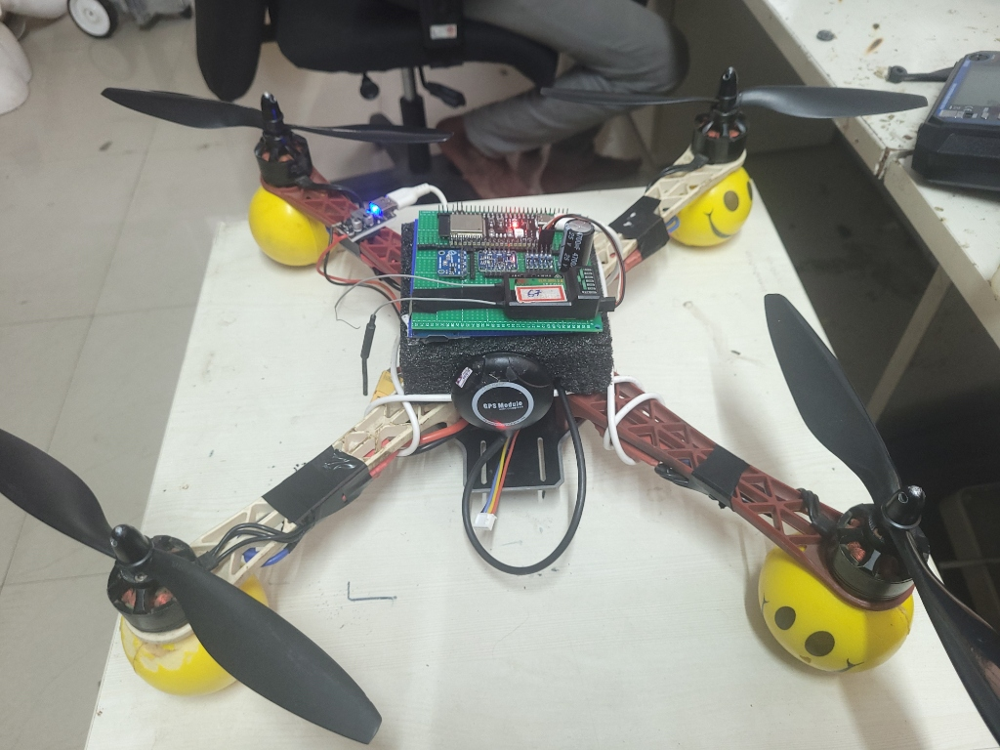
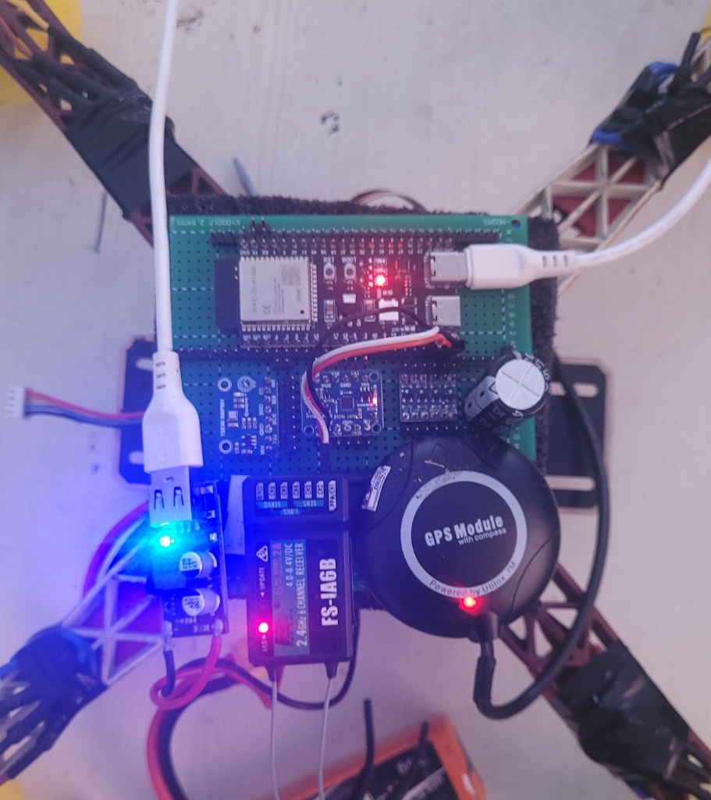
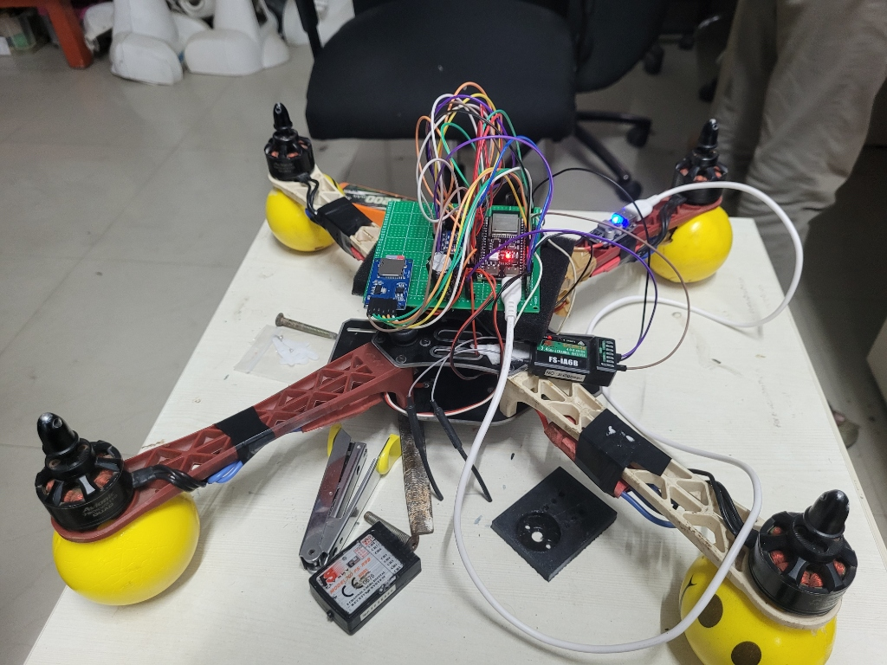

# 🦅 AeroCore-S3 Flight Controller
**A Custom ESP32-S3 Avionics Platform Ported for ArduPilot Autonomy**


---
## 🚀 Project Overview
**AeroCore-S3** is a ground-up custom flight controller designed to bridge low-cost IoT hardware (ESP32-S3) with professional-grade aerospace software (ArduPilot). 
This project demonstrates deep integration of embedded systems, custom PCB assembly, and Hardware Abstraction Layer (HAL) porting. The board successfully flies a Quad-X configuration using dual-link WiFi telemetry and full EKF3 navigation.

## Hardware Showcase

### Final Flight Assembly





### Custom PCB Build



## 📸 Hardware Showcase
<div align="center">
  
  
  <p><i>Left: Final Flight Assembly | Right: Custom Point-to-Point Wiring Map</i></p>
</div>
---
## 🧠 Avionics Architecture
The system integrates standard aerospace sensors via parallel SPI and I2C buses:
| Component | Hardware Module | Interface | ESP32-S3 Pins |
| :--- | :--- | :--- | :--- |
| **Microcontroller** | ESP32-S3 (WROOM-1) | Core | - |
| **IMU** | ICM-20948 (9-DoF) | SPI1 | CS: 10, MOSI: 11, MISO: 13, SCK: 12 |
| **Barometer** | BMP581 | I2C | SDA: 4, SCL: 5 |
| **GPS & Compass** | Ublox NEO-7M | UART & I2C | TX: 18, RX: 17 |
| **RC Receiver** | FlySky iA6B | iBUS | Signal: 16 (w/ 5V Logic Shift) |
| **Telemetry** | Onboard ESP32 WiFi | UDP | Internal AP Mode |
---
## 🛠️ Critical Engineering Solutions
Building custom avionics requires solving deep hardware/software conflicts. Detailed logs can be found in the [Engineering Log](docs/AeroCore_S3_Engineering_Log.md). Highlights include:
1. **Power Grid Stabilization (Brown-outs):** High transient current draws during WiFi radio initialization caused boot-looping. Solved by integrating a 4700uF decoupling capacitor across the 5V rail and managing PSRAM boot sequences.
2. **Hardware Watchdog Mitigation:** Identified a 40-second kernel panic caused by SD Card SPI timeout hangs. Resolved by isolating the SD Chip Select (CS) logic and patching the `HAL_LOGGING_ENABLED` flag.
3. **EKF3 "Nuclear Bypass" for Bench Testing:** Overrode ArduPilot's strict pre-arm EKF checks, forcing DCM navigation to allow for indoor, sensor-less virtual joystick tuning.
---
## ⚙️ Compilation & Flashing
This repository contains the custom hardware definition (`hwdef`) required to compile ArduPilot for this specific pinout.
**1. Build the Firmware (WSL2 / Ubuntu):**
```bash
./waf configure --board esp32s3-aerocore
./waf copter
