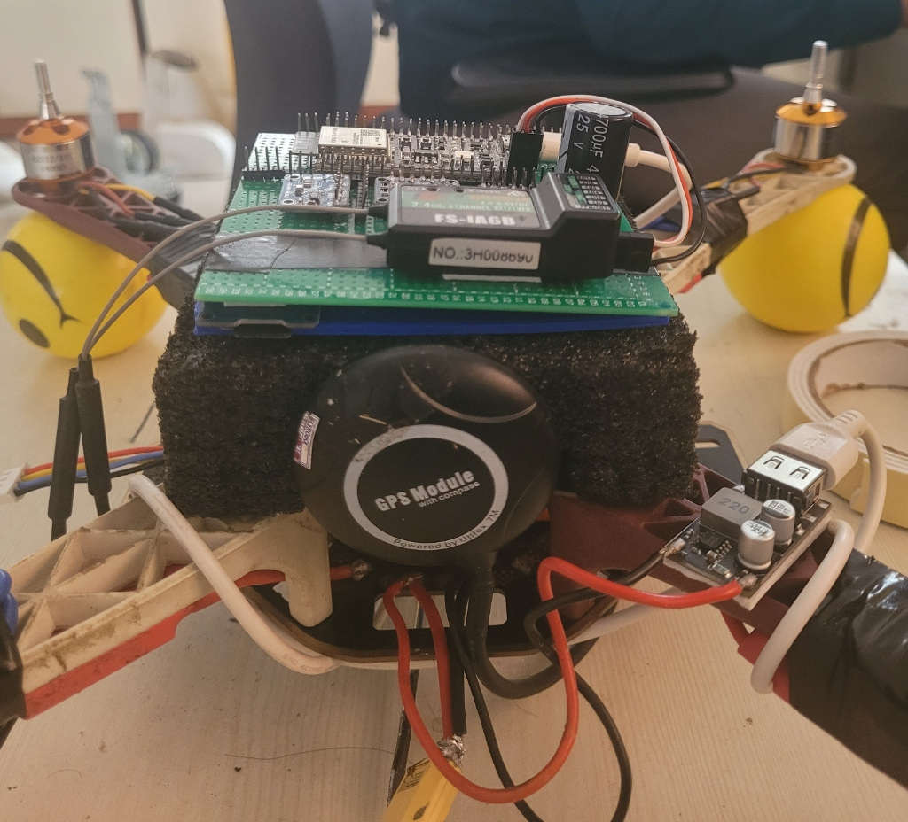
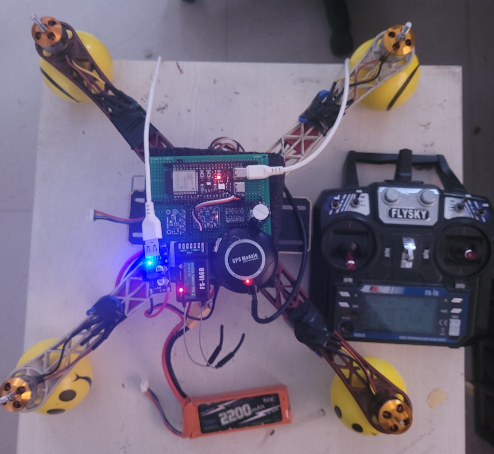
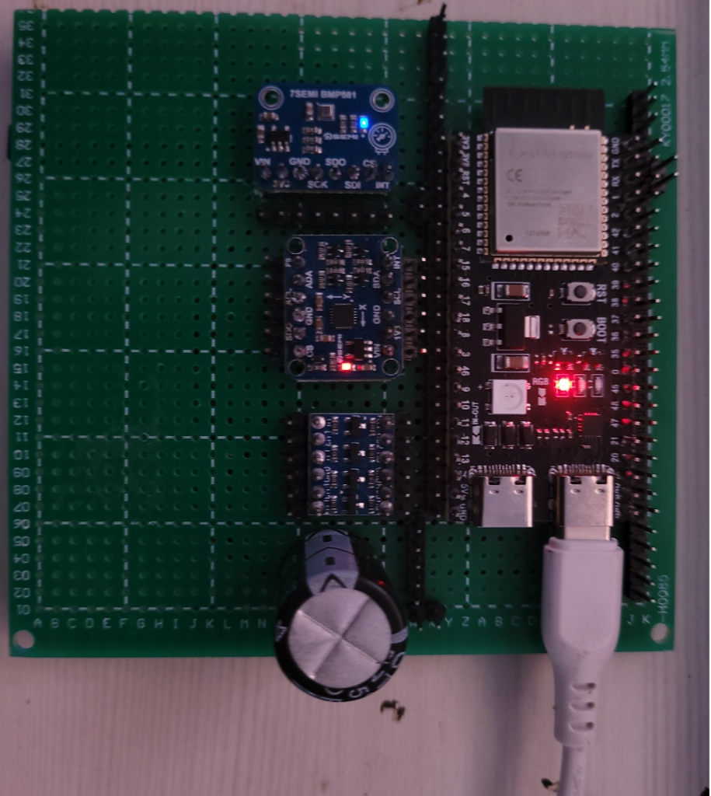
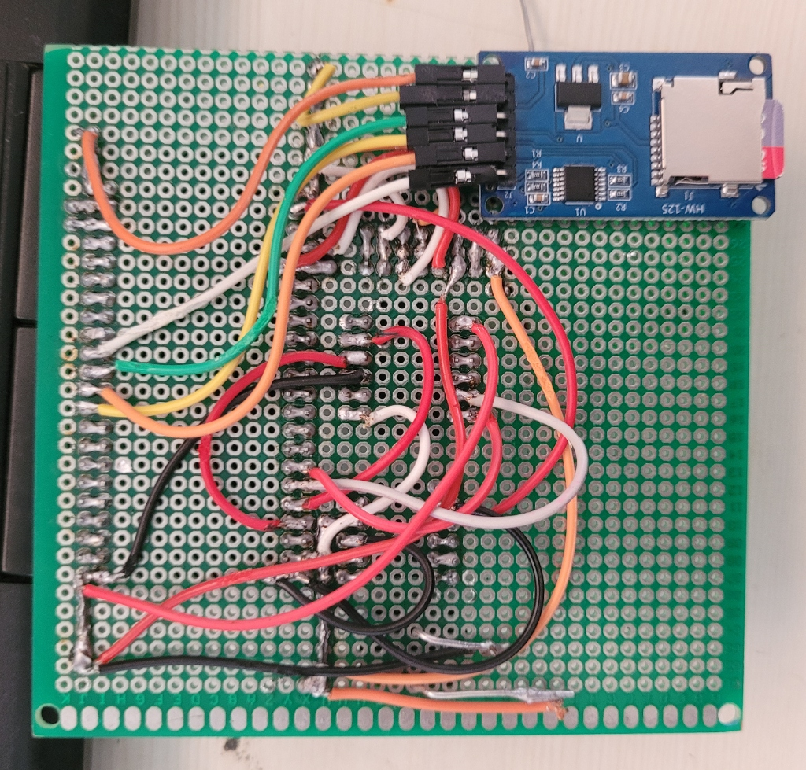
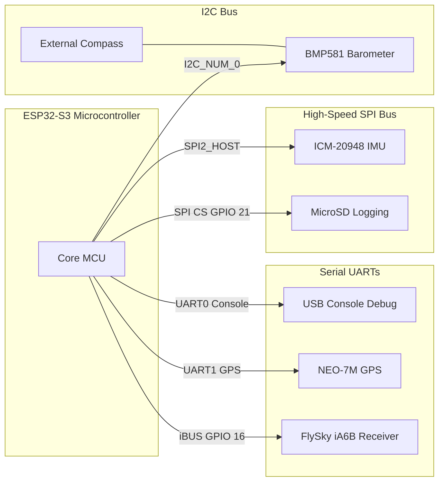

# 🦅 AeroCore-S3 Flight Controller
**A Custom ESP32-S3 Avionics Platform Ported for ArduPilot Autonomy**

[](https://www.espressif.com/)
[](https://ardupilot.org/)
[](https://mavlink.io/)
[](https://github.com/yogesh031020/AeroCore-S3-Flight-Controller)

---

## 🚀 Project Overview
**AeroCore-S3** is a ground-up custom flight controller designed to bridge low-cost, high-performance IoT hardware (**ESP32-S3**) with professional-grade aerospace software (**ArduPilot**). 

This project demonstrates deep systems engineering integration across PCB point-to-point hardware assembly, custom peripheral bus mappings, and Hardware Abstraction Layer (HAL) porting. The flight controller successfully operates a standard Quad-X configuration using dual-link WiFi telemetry (UDP) and full EKF3 navigation.

---

## 📸 Hardware Showcase

### 🛸 Final Flight Assembly
<div align="center">
  <table border="0">
    <tr>
      <td></td>
      <td></td>
    </tr>
    <tr>
      <td></td>
      <td></td>
    </tr>
  </table>
  <p><i>Top-Left: Frame Clearance Profile | Top-Right: Avionics Stack Core | Bottom-Left: Mapped Transmitter Receiver | Bottom-Right: Power-On Grid Initialization</i></p>
</div>

### 🔌 Custom PCB & Point-to-Point Wiring Map
<div align="center">
  <table border="0">
    <tr>
      <td></td>
      <td></td>
      <td></td>
    </tr>
  </table>
  <p><i>Left: Quad-X Frame Integration | Center: Custom PCB Avionics Layout | Right: Hand-Wired Low-Latency Signal Bridges</i></p>
</div>

---

## 🧠 Avionics Architecture & Bus Design
The ESP32-S3 manages telemetry, orientation loops, and motor actuators using high-frequency SPI, I2C, and UART interfaces:



| Component | Module | Bus Interface | ESP32-S3 Mapped Pins | Purpose |
| :--- | :--- | :--- | :--- | :--- |
| **Microcontroller** | ESP32-S3 WROOM-1 | Core Silicon | - | Main flight controller processor |
| **IMU** | ICM-20948 (9-DoF) | SPI2 | CS: 10, MOSI: 11, MISO: 13, SCK: 12 | Flight state estimation & acceleration |
| **Barometer** | BMP581 | I2C | SDA: 4, SCL: 5 (400kHz) | High-precision altitude hold |
| **GPS & Compass** | Ublox NEO-7M | UART & I2C | TX: 18, RX: 17 | Autonomous navigation & geo-positioning |
| **RC Receiver** | FlySky iA6B | Mapped Serial | Signal: GPIO 16 (w/ Level Shift) | Manual pilot override (iBUS protocol) |
| **Telemetry** | Onboard ESP32 WiFi | UDP Bridge | Port 14550 | Real-time QGroundControl HUD sync |

---

## 🛠️ Systems Engineering: Key Technical Challenges

AeroCore-S3's development required overcoming complex conflicts between IoT hardware limitations and real-time aerospace loops. Detailed analysis is in the [Engineering Log](AeroCore_S3_Engineering_Log.md).

> [!WARNING]  
> **Power Grid Stabilization (Brown-outs)**  
> High transient current draw (up to 400mA) during WiFi initialization caused immediate brown-out resets on the ESP32.  
> **Solution:** Integrated a **4700uF 25V decoupling capacitor** across the 5V power rail and optimized boot sequence timings.

> [!IMPORTANT]  
> **Watchdog Kernel Panic Mitigation**  
> filesystem threads hanging due to a missing or latent MicroSD card blocked the main scheduler loop, triggering the WDT post-boot.  
> **Solution:** Mapped a dedicated Chip Select (CS) isolation circuit and compiled specific debug profiles to bypass missing SD timeouts.

> [!TIP]  
> **EKF3 "Nuclear Bypass" for Indoor Tuning**  
> Indoor bench testing was inhibited by ArduPilot's strict GPS pre-arm requirements.  
> **Solution:** Created a custom parameter profile (`defaults_v34.parm`) forcing DCM navigation fallback to allow sensor-less bench tuning.

---

## ⚙️ Compilation & Flashing Guide

Custom hardware definitions (`hwdef_ultimate.dat`) and parameters (`defaults_v34.parm`) are fully integrated for seamless, reproducible compilation.

### **1. Configure & Build Firmware**
Run the custom automated build script inside WSL2 (Ubuntu):
```bash
# Make script executable
chmod +x build_v49.sh

# Run the master build tool
./build_v49.sh
```

### **2. Flash to Controller**
Connect the AeroCore board to your workstation via the UART-to-USB bridge and execute:
```bash
esptool.py --chip esp32s3 --port /dev/ttyUSB0 --baud 921600 write_flash 0x0 AEROCORE_V49_FINAL.bin
```

---

## 📂 Repository Directory Layout
```directory
AeroCore-S3-Flight-Controller/
├── config/
│   ├── defaults_v34.parm        # Flight controller defaults (EKF bypass, iBUS)
│   └── hwdef_ultimate.dat       # Mapped hardware pins & compiler directives
├── docs/
│   └── images/                  # Flight hardware assembly & wiring diagrams
├── build/
│   └── AEROCORE_V49_FINAL.bin   # Output master compiled merged binary
├── build_v49.sh                 # Fully automated build & merge compiler script
├── AeroCore_S3_Engineering_Log.md # In-depth systems engineering debugging log
└── README.md                    # Core project presentation & showcase
```

---

### **Aeronautical & Autonomy Systems Engineering Portfolio**
*   **Developed by:** Yogesh E S - Aeronautical Systems Engineer
*   **Contact/Portfolio:** [GitHub Profile](https://github.com/yogesh031020)
